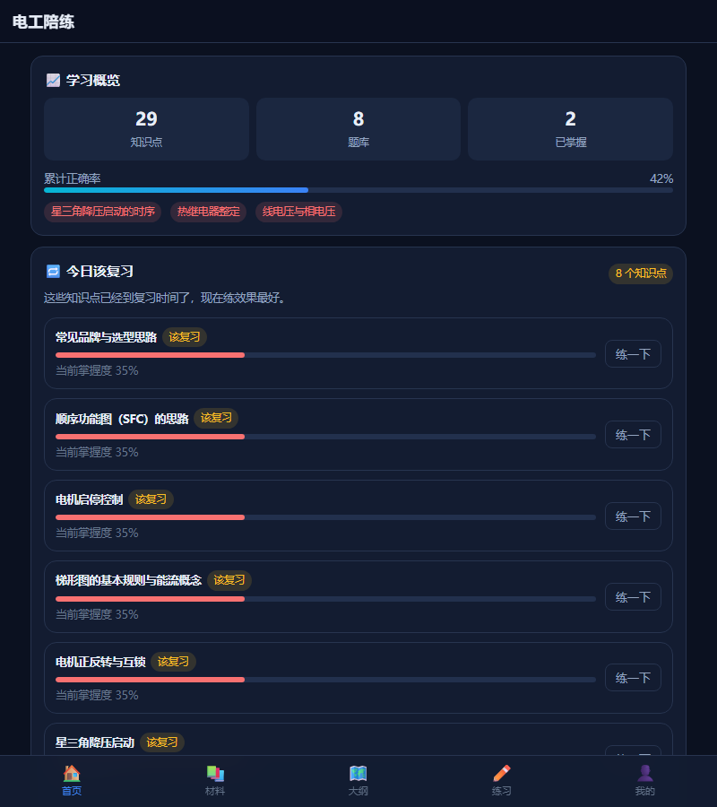
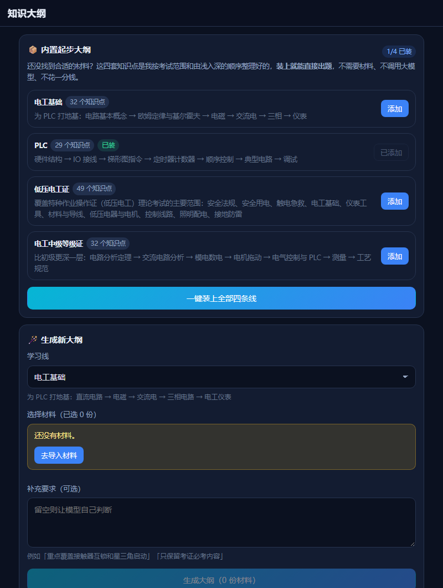
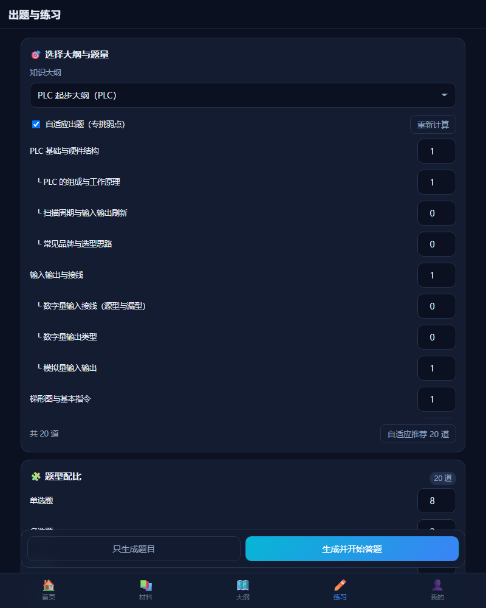
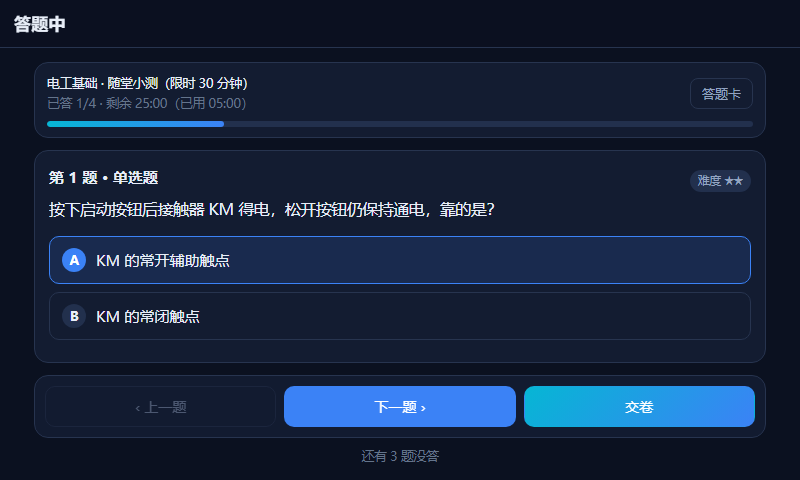
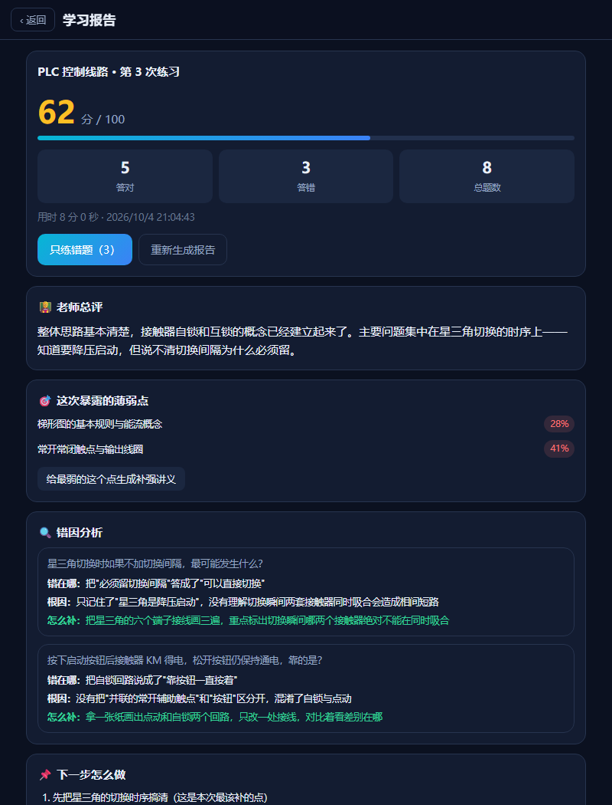
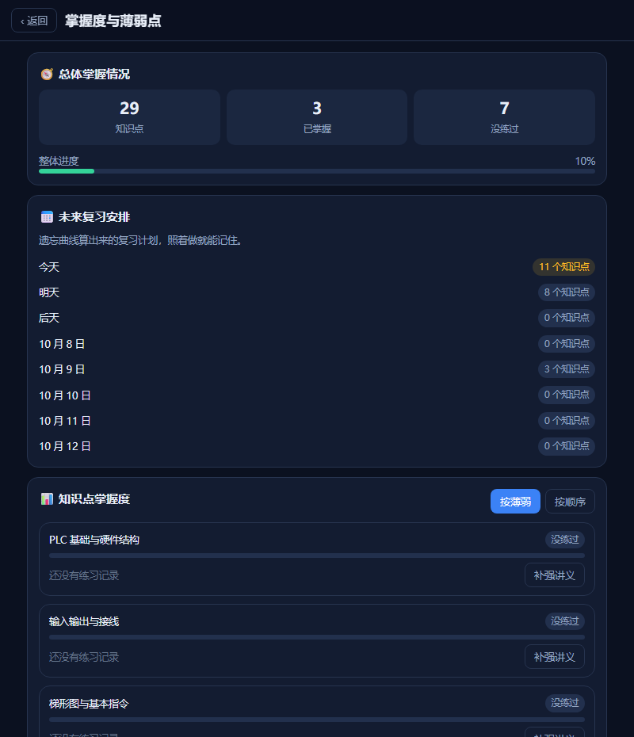
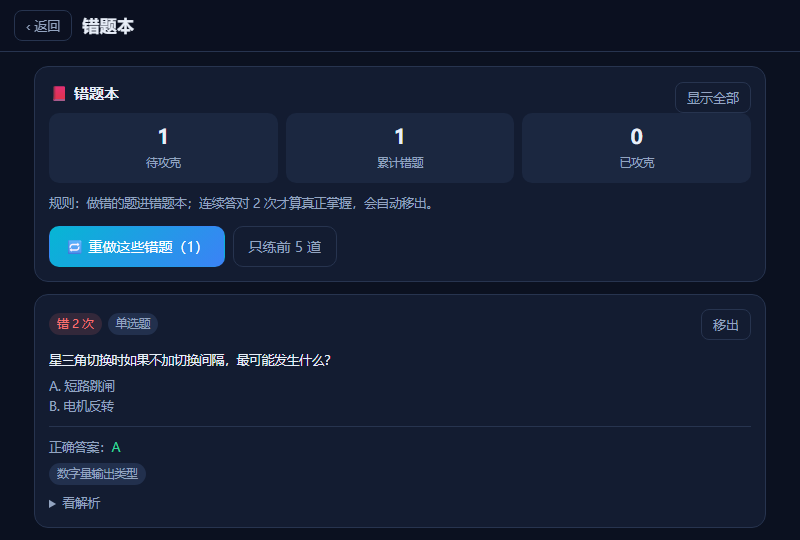

# 电工陪练 · electro-tutor

> 给电工 / PLC 自学者的 AI 陪练：**导入学习材料 → 自动出大纲 → 出题组卷 → 答题 → AI 批改 → 指出薄弱点 → 针对弱点自进化**。
> 纯前端、数据全在本机、无需服务器，可装成手机 App（PWA / APK）。

> 🚀 **只是想用，不想看技术细节？** 直接看 **[上手指南](docs/04-上手指南.md)** ——
> 5 分钟配好模型、装上起步大纲、开始出题；还有每天怎么学、怎么省钱、遇到问题怎么办。
>
> 🔧 **想自己改代码 / 打包 / 发布？** 往下读，或看 [开发与部署步骤](docs/03-开发与部署步骤.md)。

<p align="center">
  
</p>

---

## 为什么做这个

电工学习有一条很典型的路径：**电工基础 → 低压电工证 / 电工中级等级证 → 电气控制 → PLC**。

但自学时最难受的不是"看不懂"，而是**没人考你**：
- 看完了视频，不知道自己是真懂了还是"感觉懂了"；
- 做错的题没人告诉你为什么错、根因在哪；
- 错过的知识点下次还会错，因为没人提醒你复习；
- 网课、抖音、MOOC 的内容散在各处，串不成体系。

这个项目就是解决这四件事。它不是又一个刷题软件，而是一个**会记住你弱点的陪练**。

---

## 功能

### 0. 内置起步大纲（装上就能用，一分钱不花）
四条学习线（**电工基础 / PLC / 低压电工证 / 电工中级**）的知识点树是**内置**的，共 100+ 个知识点。
装好 App 的第一件事就能「装上起步大纲 → 直接出题」，**不需要先找材料，也不调用大模型**。
等你导入自己的教材/讲义后，AI 生成的个性化大纲会取代或补充它。

> 这一步专门用来消灭"新用户打开 App 一片空白、不知道从哪开始"的问题。

### 1. 喂料：把各种材料变成可出题的内容
| 来源 | 说明 |
|---|---|
| 粘贴文本 | 万能兜底，把课程要点、字幕直接粘进来 |
| 网页链接 | 抓取正文（教程文章、课程介绍页） |
| B站视频 | 优先自动抓官方 CC 字幕；没有字幕会给出替代方案 |
| 上传文档 | PDF / Word(docx) / PPT(pptx) / Excel(xlsx) / TXT / Markdown / HTML / CSV |
| 拍照识图 | 用视觉模型把课件、电路图、公式截图转成文字（**发送前自动压缩**：长边缩到 1280，手机拍的几 MB 照片会变成几百 KB，省流量也省钱） |

### 2. 大纲：先把知识变成体系
AI 通读材料后提炼出**知识点树**（最多 3 层、8~25 个知识点），每个知识点带一句话说明和重要度评分。你可以手动增删改。

**任何知识点都可以点「讲」让老师当场讲一遍**——没做过题也能用，固定四段结构（一句话说清 / 为什么是这样 / 怎么记怎么算 / 最容易错的地方），讲完还会自动生成 3 道巩固题。

### 3. 出题：六种题型 + 自适应
单选 / 多选 / 判断 / 填空 / 简答 / 计算。

**自适应出题**是默认模式：按你的掌握度自动决定每个知识点出几道——越薄弱的地方出得越多，已掌握的地方保留少量防止遗忘。

### 4. 答题与批改
- **草稿自动保存**：答一题存一题，切到后台、锁屏、被系统回收都不会丢答案；限时卷时间到会自动交卷
- **客观题本地判分**：不出网、不花钱、100% 准确。多选支持"漏选给一半、错选不得分"的国内考试规则。
- **主观题 AI 批改**：按评分点逐步给分，能区分"思路对但算错数"和"概念混淆"，并允许你**申诉重判**。

### 5. 学习报告
总分 → 老师总评 → 逐题错因分析（错在哪 / 根因 / 怎么补）→ 薄弱点列表 → 下一步建议。

### 6. 题库导入导出
找到现成的题库时（比如低压电工证的官方题库），**Excel(.xlsx) 可以直接导**，CSV、制表符分隔的文本也都认——不用先另存为某种格式。

- 表头要包含「题干」，其余列（题型、选项A~F、答案、解析、难度、知识点）**中英文都认、顺序随意**
- 分隔符**自动识别**（逗号 / 制表符 / 分号），从 Excel 复制粘贴出来的也能直接用
- 导入时知识点会**自动匹配**已有节点，匹配不到就自动建一个（否则题目没有归属、掌握度统计不到）
- 导出带 UTF-8 BOM，Excel / WPS 双击打开不乱码，而且**导出的文件能被自己完整导回来**（这条有测试守着）

### 7. 自进化闭环（核心）
```
做题结果
  ↓
① 知识点掌握度模型    每题挂知识点标签，指数滑动平均更新
  ↓
② 遗忘曲线复习排程    间隔重复：1 天 → 3 天 → 间隔×难度因子
                      （题库里没题时会自动补生成，不用先去别处出题）
  ↓
③ 自适应出题          权重 = (1−掌握度)² + 0.15，薄弱点权重高但不饿死已掌握点
  ↓
④ 学习者画像迭代      自动沉淀"你总错在哪、错因是什么、哪种讲法你听得懂"，
                      每次出题/讲解/批改都会把这份画像注入提示词
  ↓
⑤ 薄弱点补强微讲义    针对卡住的知识点生成"3 分钟讲清 + 3 道即时巩固题"
  ↓
（回到做题，形成闭环）
```

算法细节见 [`docs/02-架构说明.md`](docs/02-架构说明.md)。

---

## 界面长什么样

下面都是从**真实构建产物**里截的图（用 `npm run build:preview` 生成的离线预览页面截的，不是设计稿）。
第一次用它长这样：

**首页 · 学习概览 + 今日该复习**（遗忘曲线算出来的，点「练一下」直接开始）



**知识大纲 · 内置起步大纲**（不花一分钱，装上就能出题；也可以喂自己的材料生成）



**出题练习 · 自适应分配**（薄弱的点自动多出题，手动改过就不再覆盖）



**答题 · 限时卷**（答一题存一题，切后台、锁屏、被杀都不丢答案）



**学习报告 · 总评 + 逐题错因 + 下一步**（客观题本地判分不花钱，主观题 AI 按评分点给分）



**掌握度与薄弱点 · 遗忘曲线复习排程**（每个知识点的掌握度、下次该复习的日期、一键生成补强讲义）



**错题本 · 连对两次才算掌握**（自动移出，不用手动清理）



---

## 快速开始

> 📱 **在手机上用**：看 [上手指南](docs/04-上手指南.md)（三步就能开始）。
> 下面这些是给开发者的。

> ⚡ **最快的开始方式**：装好之后先到「大纲」页点「一键装上全部四条线」，
> 然后直接去「练习」页出题——不用找材料、不用调模型。之后再把你的教材导入进来。

### 方式一：网页版直接用（最快，推荐先试）

```bash
git clone https://github.com/<你的用户名>/electro-tutor.git
cd electro-tutor
npm install
npm run dev
```

浏览器打开终端里显示的地址（默认 http://localhost:5173 ）。
手机和电脑在同一个 WiFi 下时，用手机浏览器打开 `http://电脑局域网IP:5173`，
然后**添加到主屏幕**，就是一个全屏 App 了。

### 方式二：构建静态站点自己托管

```bash
npm run build      # 类型检查 + 打包，产物在 dist/
npm run serve      # 用内置极简服务器预览 dist/（默认 http://127.0.0.1:4173）
```

`dist/` 是纯静态文件，扔到任何静态托管（GitHub Pages / Vercel / Netlify / 自己的 NAS）都能跑。

### 方式三：生成单文件离线版

```bash
npm run build:single   # 产物：dist-single/single.html（约 1.2 MB，CSS/JS 全内联）
```

得到一个**自包含的 HTML 文件**，双击就能打开，不需要服务器、不需要联网安装。
适合发到微信里直接在手机上打开，或者拷到 U 盘给别人用。

> ⚠️ 注意：用 `file://` 双击打开时，浏览器不允许页面使用本地数据库（IndexedDB），
> 所以这个单文件版**必须通过 http 打开**才可用（例如放到任意静态托管上）。
> 直接双击只会看到一条明确的错误提示，不会白屏。

### 方式四：打包安卓 APK

安卓工程（Capacitor）**已经在仓库里了**，准备好 JDK 21 + Android SDK 后一条命令出包：

```bash
npm run apk        # 调试版，产物在 android/app/build/outputs/apk/debug/
```

没有 Android Studio、或者网络受限装不上 SDK？仓库里带了一键工具链脚本：

```bash
node scripts/setup-android-toolchain.mjs   # 把 JDK 21 + Android SDK 装到仓库同级 .android-tools/
```

详细步骤、CI 配置和排障见 [`docs/03-开发与部署步骤.md`](docs/03-开发与部署步骤.md)。

---

## 配置大模型

打开 App 底部「我的」→「大模型配置」→ 选一个预设服务商 → 填 API Key → 保存。

支持的预设（只要服务商兼容 OpenAI 协议，都能接）：

| 服务商 | 用途 | 备注 |
|---|---|---|
| **DeepSeek** | 主力文本模型 | 中文强、价格极低，**最推荐** |
| **智谱 GLM** | 文本 + 识图 | `glm-4-flash` / `glm-4v-flash` 是免费档，适合识图 |
| 阿里通义千问 | 文本 + 识图 | `qwen-vl` 系列识电路图效果不错 |
| 字节豆包（火山方舟） | 文本 + 识图 | 模型 ID 要填接入点 ID（`ep-xxxxxxxx`） |
| 本地 Ollama | 完全离线 | 手机需填电脑的局域网 IP |

> 🔒 **API Key 只保存在这台设备的本地数据库里**，不会上传、不会进 Git、也不会写进导出备份。

### 如果提示"网络请求被拦截"

网页版是**浏览器直接请求**大模型接口的，服务商必须放行跨域（CORS）才行。
实测结果（可用 `npm run probe:cors` 随时复现）：

| 服务商 | 浏览器能否直连 |
|---|---|
| DeepSeek | ✅ 可以 |
| 智谱 GLM | ✅ 可以 |
| 阿里通义千问 | ✅ 可以 |
| 字节豆包（火山方舟） | ✅ 可以 |
| OpenAI | ⚠️ 国内网络不通，需要自己配代理 |

**所以上面推荐的几家都能直接在网页版里用**，不需要额外搭代理。
万一以后服务商改了策略，三种解法：

1. 换一家支持 CORS 的服务商；
2. 在「模型配置」里填**代理前缀**（如 `https://你的代理/?url=`）；
3. 用 APK 版——原生请求（CapacitorHttp）不受浏览器跨域限制。

### 如果模型不按格式回答

大模型偶尔会"不听话"——这不用你操心，每一处都做了容错，而且原则是**要么救回来，要么明确报错，绝不悄悄塞错数据**：

| 模型的毛病 | 程序会怎么做 |
|---|---|
| JSON 外面裹着 ``` 代码块、前后带一段解释、尾逗号、被 max_tokens 截断 | 自动剥壳/补齐；仍失败就带上错误重试一次 |
| 知识点名写成 `title` / `名称`，说明写成 `description`，子节点写成 `sub` / `items` | 按同义字段认；**没有名字的节点直接丢掉并告诉你丢了几个**，不会被当成知识点塞进大纲；如果只是"章"这一层漏了名字，它下面有名字的小节点会**提升上来**，不会连内容一起丢 |
| 选项给成 `["甲","乙"]` 字符串数组、答案写成选项原文 | 自动补 A、B、C…，答案反查回字母 |
| 某道题缺答案 / 选项不到两个 / 答案不在选项里 | 这道题**不入库**（这种题要么没法答，要么答对也判错） |
| 批改时分数写成百分数、或只给了分步得分没给总分 | 按多级回退算出分数；实在读不出来就明确报错，**不会当成 0 分** |
| 报告里没写总评 | 用本地统计的薄弱点拼一段，报告照样出得来 |

这些行为都有测试盯着（见下面的测试表），所以不会因为哪次改代码悄悄退化。

---

## 技术栈

| 层 | 选择 | 为什么 |
|---|---|---|
| 前端 | React 19 + TypeScript + Vite 8 | 生态成熟、构建快 |
| 本地数据 | IndexedDB（Dexie 4） | 全离线、隐私好、零服务器成本 |
| 路由 | react-router（HashRouter） | 便于后续以 `file://` 被 App 壳加载 |
| PWA | vite-plugin-pwa | 可添加到主屏幕、离线可用 |
| 安卓壳 | Capacitor 8（JDK 21） | 网页和 App 共用一套代码，原生 HTTP 绕开跨域 |
| 大模型 | 自研 OAI 兼容适配层 | 预设 + 自定义，支持流式与原生 HTTP |
| 文档解析 | pdfjs-dist / mammoth / jszip | 不依赖后端 |

**零后端**：没有服务器、没有数据库、没有账号体系。所有数据都在你的手机里。

---

## 项目结构

```
electro-tutor/
├─ docs/                        # 上手指南（给使用者）+ 需求/方案/架构/部署（给开发者）
├─ public/                      # 图标等静态资源
├─ scripts/
│  ├─ lib/png.mjs               # 零依赖 PNG 生成与绘图（zlib 手写 PNG）
│  ├─ lib/inline.mjs            # 把构建产物合并成单文件 HTML（单文件版与预览版共用）
│  ├─ gen-icons.mjs             # 生成 PWA 图标
│  ├─ gen-android-assets.mjs    # 生成安卓图标与启动页（替换 Capacitor 默认素材）
│  ├─ setup-android-toolchain.mjs # 一键装 JDK 21 + Android SDK 到 .android-tools/
│  ├─ build-apk.mjs             # 一键出 APK（跨平台）
│  ├─ build-single.mjs          # 打包成单文件离线 HTML
│  ├─ build-preview.mjs         # 生成可离线打开的 UI 预览（用于视觉检查）
│  ├─ publish-github.mjs        # 一条命令发布到 GitHub（建仓 + 推送 + 标签）
│  └─ serve-dist.mjs            # 预览 dist/ 的极简静态服务器
├─ android/                     # Capacitor 生成的安卓工程
├─ .github/workflows/android.yml # 推 tag 自动出 APK 并挂 Release
├─ src/
│  ├─ components/               # 通用 UI 组件 + Markdown 渲染器
│  ├─ features/                 # 按页面组织的功能模块
│  │  ├─ home/                  # 首页：今日复习 + 薄弱点
│  │  ├─ ingest/                # 材料导入
│  │  ├─ outline/               # 大纲生成与编辑
│  │  ├─ practice/              # 出题、组卷
│  │  ├─ exam/                  # 答题
│  │  ├─ report/                # 学习报告
│  │  ├─ wrong/                 # 错题本
│  │  ├─ knowledge/             # 掌握度地图 + 补强讲义
│  │  └─ settings/              # 模型配置 + 画像 + 备份
│  └─ lib/
│     ├─ db/                    # 数据模型与 Dexie 封装
│     ├─ llm/                   # 大模型适配层 + 提示词库
│     ├─ extract/               # 文件/网页/B站字幕 → 文本
│     ├─ seed/                  # 内置起步大纲（四条线的知识点树）
│     ├─ srs/                   # 自进化算法引擎（纯函数）
│     └─ services/              # 业务编排层
└─ vite.config.ts
```

---

## 测试

```bash
npm test            # 跑一遍全部单元测试
npm run test:watch  # 监听模式
```

覆盖这些最容易出错、又最不该出错的地方：

| 测试文件 | 保护什么 |
|---|---|
| `src/lib/srs/srs.test.ts` | 掌握度、遗忘曲线、薄弱点排序、自适应出题的**算法性质**：遗忘单调性、难度因子上下限、题量分配之和不丢不多、纯函数不改入参 |
| `src/lib/llm/json.test.ts` | 大模型**不干净输出**的容错解析：代码围栏、前后解释文字、多余尾逗号、被 max_tokens 截断 |
| `src/lib/services/grade.test.ts` | 客观题**判分规则**：多选漏选给一半/错选零分、判断题六种写法归一化、填空按空给分、百分制加权；以及**AI 评分结果的容错**（字段名换了、写成百分数、只给分步得分，都要能算出分；实在读不出就返回 null 而不是当成 0 分） |
| `src/lib/services/integration.test.ts` | **完整闭环**：在内存数据库里真的走一遍「材料 → 大纲 → 出题 → 组卷 → 判分 → 交卷 → 报告 → 掌握度/错题 → 自适应出题 → 今日复习 → 补强讲义」，大模型调用被替换成固定应答，验证的是我们自己的装配逻辑。以及**分批出题**：要 8 道题会分两批（5+3）去要且都要入库；**某一批失败不毁掉整次出题**（已出的题照样留下并说明哪批没成） |
| `src/lib/services/exam-draft.test.ts` | **答案不能丢**：草稿合并写入不会冲掉已批改的分数、重复保存不会产生重复条目、交卷中途失败后未批改的题仍保留答案 |
| `src/lib/llm/client.test.ts` | **大模型客户端**：请求拼装、流式 SSE 解析、网关无视 `stream` 时的自动退回、JSON 模式降级重试、401/403/404/429/5xx 的中文翻译、代理前缀；**空闲超时**（服务端一直不回时要放弃、并说清是哪个模型/打到哪家/下一步怎么办；流式慢慢吐字不能被误杀；调用方自己取消不能被误报成超时）；**识图能力测试**（对识图配置要真的发一张图过去——模型答出蓝/圆才算真看到，答非所问要判定"它没看图"）；**思考模式**（要 JSON 的任务自动对 DeepSeek/通义/智谱关思考、关掉后才发 temperature、`*-reasoner` 不动它、**不认识的服务商绝不乱发字段**）；**空回复不算成功**（HTTP 200 但没正文必须报错并提示去点测试连接、只回了 `reasoning_content` 要说清"没给最终答案"、流式只收到 `[DONE]` 也不算内容）；**偶发连接中断自动重试一次**且把英文原文翻成人话 |
| `src/lib/seed/seed.test.ts` | **内置大纲数据质量**：名称在同一条线内不重复、层级 ≤3、重要度合法、每条线都有叶子节点与重点标记 |
| `src/lib/services/bank.test.ts` | **题库导入导出**：CSV 引号/逗号/换行/BOM 边界、分隔符自动识别、**Excel 直读**、表头驱动解析、答案归一、**往返一致**、知识点自动匹配与新建 |
| `src/lib/services/outline.test.ts` | **删除时的数据完整性**：删大纲会连题目/错题记录一起清掉（否则题库里会留下永远统计不到、又清不掉的孤儿题）；删知识点会摘掉题目上的引用，但**不删题目**。**大纲结构的容错**：模型写 `title`/`名称` 当知识点名、写 `sub`/`items` 当子节点都能认，没有名字的节点被丢弃并计数，无名"章"下面有名字的小节点会提升一层而不是被吞掉。以及**用现成标题直接建大纲**（不调模型）：材料自带标题的判定（慕课 `sections` / 教材微课标题 / 两者都没有就返回空）、标题去空白去重按原样铺开、**不自己编章节名**、标题不足两个时明确报错 |
| `src/lib/services/generation-runner.test.ts` | **出题后台任务**（起因：用户实测"生成中点了我的或首页，回来就没了"、"一开始生成就不能取消"）：状态在模块级单例里、订阅者能收到变化（切页面看得到进度的依据）；取消**保留已出的题**且不再开新批次；暂停在批次之间生效、继续后能跑完；已有任务时不重复启动；失败原因进状态。写这些用例时抓出两个真 bug：暂停后状态永久卡死、旧任务的迟到结果覆盖新任务（已修） |
| `src/features/exam/ExamPage.test.tsx` | **答题页交互**（jsdom 真点）：点选项后草稿真的落盘、翻页后选择还在、重新进入能恢复草稿、提前交卷会弹确认、交卷后分数与错题真的进库、答题卡能跳题 |
| `src/features/ingest/IngestPage.test.tsx` | **导入页交互**：填表保存真的落库并清空表单、空内容只提示不写入、切换学习线会带上、切换模式会换表单、材料可删除 |
| `src/features/outline/OutlineListPage.test.tsx` | **大纲页交互**：一键装上四条线真的装进 4 套大纲 + 90 多个知识点，重复点击不会翻倍 |
| `src/lib/platform/image.test.ts` | **图片压缩**：等比缩放长边严格不超上限、极端比例与四舍五入都不越界、本来小的不二次压缩、解码失败要退回原图而**不能挂死** |
| `src/lib/platform/save-file.test.ts` | **导出文件**：网页版走浏览器下载、App 版走系统保存面板、用户取消不算失败、真正的失败不能吞掉 |
| `src/lib/services/quiz-normalize.test.ts` | **模型输出的规范化与校验**：选项给成字符串数组时自动补 A、B；答案写成选项文本时反查回字母；缺答案 / 选项不足两个 / 答案不在选项里的题**一律不入库**（这类题要么没法作答、要么答对也判错） |
| `src/features/practice/PracticePage.test.tsx` | **练习页交互**：打开页面就自动把题量算好、主按钮直接可点（不是一屏灰按钮）；自动分配会按知识点铺开而不是只填一个；手动改过的题量不会被自动计算覆盖 |
| `src/features/settings/SettingsPage.test.tsx` | **"填 API Key"这条路用户能不能走通**（起因是真实反馈："只给了服务商选择，没地方填 Key"——其实输入框在弹层里，但第一屏找不到入口）：第一屏必须有"填 API Key"的入口、弹层第一个字段就是 Key 且是密码框、**模型不预先填死**（也**不再用 App 里写死的推荐列表**，只认联网拉回来的）、填完 Key 失焦会自动联网拉模型列表、点标签能选中并正确保存、没选模型时明确报错且不存半成品 |
| `src/lib/scan/decode.test.ts` | **二维码/条码是真解码，不是让 AI 猜**：用 `qrcode` 现场生成真二维码→渲染成像素→解码，解出的文本必须与生成时一字不差；深底浅码（反相）、拍歪 90° 都要能解；**码只占大图一角（模拟拍整张封底）也要能解**（靠分块 + 放大，这条是从用户真照片里学到并加上的）；空白图/噪点必须返回 null 而不能编结果；**没有码的图有时间预算**，不能让用户干等；ISBN 校验位错的号码必须拒绝。最后一条是**真照片回归**：拿用户实拍的《零基础学电工》条码照片解出 `9787111589549` 并校验通过 |
| `src/lib/scan/book.test.ts` | **书皮识别、扫码归类、以及"让 App 自己去抓微课内容"**：视觉模型把 JSON 包在 ``` 里 / 字段名换成中文 / 作者给成数组，都要能解析；看不清的字段必须留空**而不是猜**；扫到的是 ISBN、网址还是普通文本要分对；微课清单按网址去重、占位标题会被更具体的标题替换；书目信息要组织成能出题的材料正文；**逐个抓微课链接时，抓到正文的进成功、正文太短的（视频页）要给出可操作的原因、单个失败不影响其他** |
| `src/features/book/BookAddPage.test.tsx` | **"加一本教材"这条路走得通**：拍书皮后书名/出版社/主编/版次自动填好**且都能改**（AI 认错是常事）；扫到微课二维码进清单并自动去重；扫到 ISBN 会填进字段并显示校验通过；校验位错的号码不被当成 ISBN；拍糊了要明确告诉用户怎么拍；保存后材料库里有一条「教材」材料、正文含书目与微课清单；书名为空时拒绝保存；**点「让 App 去抓微课内容」后，抓到正文的存成材料、抓不到的给原因且不建材料、重复点不重复抓**；**带 id 打开就是"补充微课"**（载入已有书目与微课清单、保存是更新同一条、保留原创建时间与学习线） |
| `src/lib/mooc/icourse163.test.ts` | **慕课整门抓取**（不联网，用假通道测编排）：各种形态的课程链接都要能认出 courseId/tid，认不出要给**可操作**的提示（"链接里缺少 tid=，请这样补"）；四种题型（1 单选 / 2 多选 / 3 填空 / 4 判断）映射正确，答案复用 `bank.ts` 的 `parseAnswer` 保证与 CSV 导入规则一致；**没有答案的题一律丢弃**；接口报错/返回非 JSON/拿不到 cookie 都要明确报错而不是静默给空列表；转成导入行后表头与列序要和 CSV 导入对得上 |
| `src/features/mooc/MoocImportPage.test.tsx` | **"粘一个链接 → 挑题 → 导入"这条路走得通**：网页版（没有原生通道）必须明确提示"请用 APK 版"而不是报跨域错误；抓到后显示课程名/课时清单；默认全选且能逐题取消、按题型与关键词筛选；导入后题目真的进题库、按课时名建出知识点、课程本身也存成材料；服务端报错原文要带给用户 |
| `src/lib/services/quiz-chunk.test.ts` | **分批出题的数学**（起因：用户实测"要 20 道题半天出不来"）：每批总量不超过上限、同一个知识点要得多会拆到多批、多个知识点会凑满同一批而不是留半空、**总量一道不多一道不少**、正好装满不产生空批、题型配比按比例缩到每批题量且**之和正好等于那一批的题量** |
| `src/features/pages.render.test.tsx` | **每个页面都能渲染**：用服务端首屏渲染确认 10 个页面在无数据时不会白屏（模块导入即崩、hook 用错、空数据越界） |
| `src/docs-consistency.test.ts` | **文档不会腐烂**：README/docs 里提到的 npm 脚本、相对链接、源码路径都真实存在；知识点数量与内置数据一致；测试文件表与磁盘上的文件一一对应 |

当前状态：**448 个用例全部通过**（26 个测试文件）。

### 想看界面长什么样

单元测试只能证明"DOM 里有没有某个元素"，证明不了"它看起来对不对"。需要亲眼看的时候：

```bash
npm run build:preview    # 产出 dist-preview/preview-*.html（8 个页面，双击即可打开）
```

它内联了内存版 IndexedDB 和一批示例数据，所以**不需要服务器、不经过网络代理**也能渲染。
正式构建完全不受影响（示例数据不进 App）。详见 [`docs/03-开发与部署步骤.md`](docs/03-开发与部署步骤.md)。

---

## 路线图

- [x] **M0** 项目骨架、PWA
- [x] **M1** 模型配置、材料导入、大纲生成
- [x] **M2** 出题、组卷、答题
- [x] **M3** 本地判分 + AI 批改 + 学习报告
- [x] **M4** 错题本、掌握度、遗忘曲线排程
- [x] **M5** 自适应出题、学习者画像迭代、补强微讲义
- [x] **M6** Capacitor 安卓工程 + 一键打包脚本 + GitHub Actions 自动出包
- [x] **M7** 推送到 GitHub、发布首个 Release —— ✅ 已发布：
      <https://github.com/mengxiangbaofu888/electro-tutor/releases>（打 `v*` 标签自动构建 APK 并挂到 Release）
      → 发布新版本的流程见 [`docs/03-开发与部署步骤.md`](docs/03-开发与部署步骤.md) 第六节
- [x] **M8** 题库导入导出（Excel 直读 / CSV / TSV，含往返一致性测试）
- [ ] **M9** 更多平台字幕适配（抖音 / MOOC）、考前冲刺模式、题库导出成 Excel 原生格式

> ✅ 安卓安装包**已经在本机构建验证过**：`app-debug.apk`，
> 包名 `com.electrotutor.app`，应用名「电工陪练」，minSdk 24 / targetSdk 36，
> 用 Android Debug 证书签名，可直接安装。
>
> （不在这里写死体积——它会随依赖和工具链变化，写死了只会变成错的。想加插件前先估算大小，
> 可以看 `docs/03-开发与部署步骤.md` 里关于体积的说明。）

---

## 常见问题

<details>
<summary><b>为什么给它一个视频链接，它说抓不到内容？</b></summary>

大模型**打不开视频网页**，看不到画面也听不到声音。程序只能尝试抓视频**自带的 CC 字幕**。

没有字幕时有三条替代路：① 把课程要点粘贴进来；② 拍课件截图给它识图；③ 找课程的配套讲义（PDF/PPT）上传。

这是平台和技术的客观限制，不是 bug。免费渠道（B站/抖音/MOOC/国家智慧教育平台）里，只有部分 B站视频带字幕。
</details>

<details>
<summary><b>识图（电路图/公式截图）准不准？</b></summary>

常见元件和简单电路图识别效果不错；复杂电路图和手写公式会有误差。所以识别结果会存成可编辑的文本，**请你核对一遍再用来出题**。
</details>

<details>
<summary><b>AI 批改计算题会算错吗？</b></summary>

有可能。所以做了两层防护：① 批改时要求模型按评分点逐步给分，思路对只错算式不会全扣；② 你可以对任何一道题的批改**发起申诉**，让它带着你的理由重新复核。
</details>

<details>
<summary><b>换手机数据会不会丢？</b></summary>

会。数据只存在当前设备上。换设备前请到「我的 → 数据备份」**导出备份**（一份 JSON，不含 API Key），新设备上导入即可。

**App 版**点导出后会弹出系统面板，让你选择存到网盘 / 微信 / 本机文件。
请确认面板里确实保存成功了——如果你点了取消，App 会明确提示「备份没有生成」。

> 为什么 App 版不是直接下载：App 跑在 WebView 里，而 WebView 不实现浏览器那套下载，
> 直接 `a[download]` 会**点了没反应也不报错**。所以 App 版改走系统的文件保存 / 分享面板。
</details>

<details>
<summary><b>能不能接本地跑的模型（Ollama / vLLM）？</b></summary>

可以。在「模型配置」里把接口地址填成电脑的局域网地址，例如 `http://192.168.1.10:11434/v1`，
模型 ID 填本地模型名（如 `qwen2.5:7b`）。

两个前提：① 电脑上的 Ollama 要监听局域网（设 `OLLAMA_HOST=0.0.0.0` 后重启）；
② 手机和电脑在同一个 WiFi 下。

APK 版已经放行了明文 HTTP（安卓 9 起默认禁止），局域网 http 地址可以直接用。
但如果填的是**公网** http 地址，「模型配置」页会警告你 API Key 会以明文传输。
</details>

<details>
<summary><b>需要花钱吗？</b></summary>

软件本身免费开源，没有服务器成本。只有调用大模型 API 要花钱——用 DeepSeek 的话，一套 20 题的卷子大约几分钱，识图可以用智谱的免费模型。客观题判分完全在本地，不花钱。
</details>

---

## 致敬

出题与考试的产品形态参考了 [heshengtao/exameow](https://github.com/heshengtao/exameow)（Apache-2.0）。
本项目的代码为独立实现，差异在于：**面向电工/PLC 垂直领域**、**视频字幕与识图入口**、以及**以学习者画像为核心的自进化闭环**。

---

## 许可证

[MIT](LICENSE)
